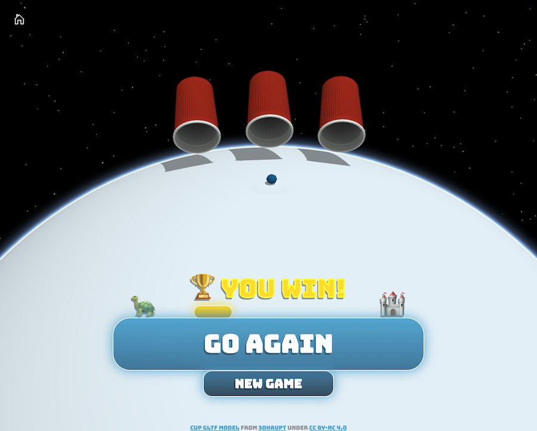

3D Cup Game :trophy:
====================

Follow the ball to rescue the princess: a web based 3D game built using the [ArcGIS API for JavaScript](https://developers.arcgis.com/javascript/).

:arrow_forward: [Play Online](https://andreasulmer.github.io/cupgame)

## Instructions

1. Press **Play** to start a new game
2. Try to remember which cup contains the ball while they are being shuffled
3. Once they stop, select the cup you think contains the ball. If you pick the correct one, you advance to the next level where the shuffling speed increases. If you pick the wrong one, you go one level back. And you definitely want to avoid becoming a :turtle:\
  \
  Press **Go Again** to continue playing or **New Game** to start over
  
4. After selecting the correct cup enough times in a row, you reach the :european_castle: where the :princess: is released from the hands of the lord evil\
  \
  Congratulations, happy end!

## Features

* Cups are shown using the [glTF import](https://developers.arcgis.com/javascript/latest/sample-code/import-gltf/index.html) feature introduced in 4.11
* [SceneView.hitTest](https://developers.arcgis.com/javascript/latest/sample-code/sceneview-hittest/index.html) determines which cup was selected and whether it contained the ball
* Animating [Graphic.geometry](https://developers.arcgis.com/javascript/latest/api-reference/esri-Graphic.html#geometry) to make the cups move smoothly

## Licensing

The cup game is licensed under the Creative Commons Attribution-NonCommercial 4.0 International Public License (CC-BY-NC 4.0).

A copy of the license is available in the repository's [license.txt](./license.txt ) file.

The [glTF cup model](https://sketchfab.com/3d-models/low-poly-plastic-cup-free-download-89938b8ecedf4ab89d78fd9f4b40b2a4) is a modified version from [3DHaupt](https://sketchfab.com/dennish2010) also licensed under (CC-BY-NC 4.0).

The fonts used in the game are licensed under SIL OpenFont License. A copy of the license is available in the repository's [font-license.txt](./font-license.txt) file.